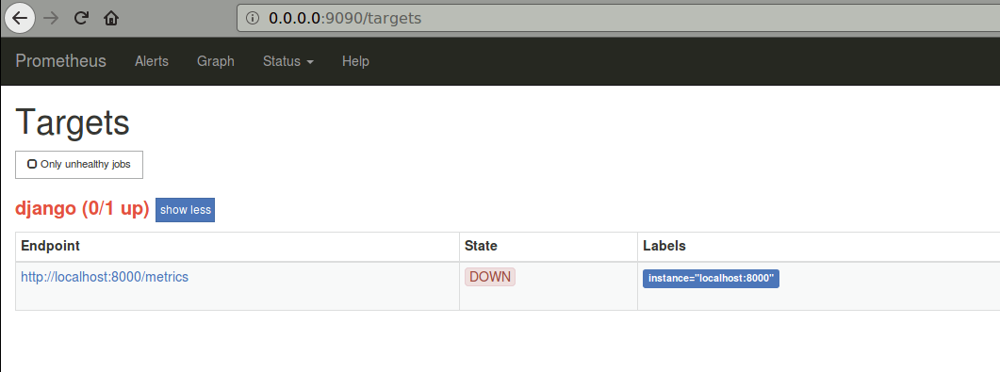
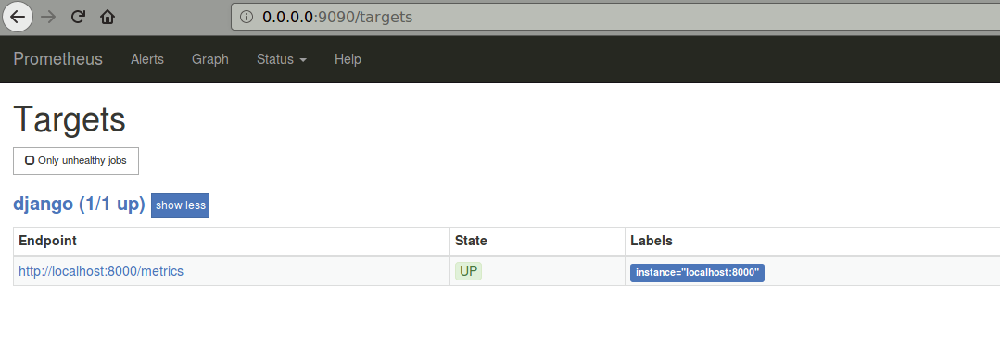
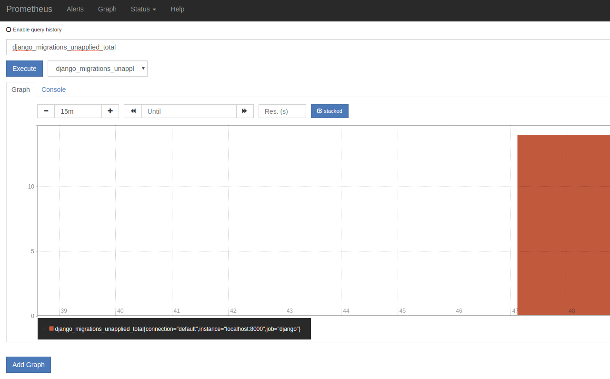
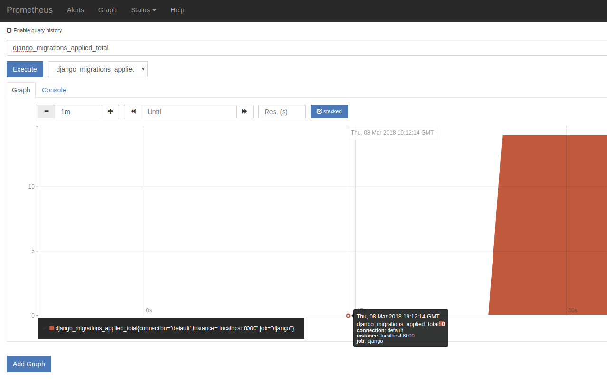

# Prometheus Django

Instrumenting a Django server with [Prometheus](https://prometheus.io/).

## Motivation

Prometheus is a monitoring and visualization tool that can easily be used to instrument Kubernetes.

This follows on from my [Cloud Django](https://github.com/mramshaw/Cloud_Django) exercise.

## Prometheus Installation

1. Download the [latest stable release for your platform](https://prometheus.io/download/).

    [At the time of writing this is `prometheus-2.1.0.linux-amd64.tar.gz`]

2. Note the checksum.

    [At the time of writing this is `f181f619c9a8e0750c1ac940eb00a0881cc50386d896f06f159e9a5b68db60a0`]

3. Verify the checksum (SHA 256 Checksum):

    $ sha256sum prometheus-2.1.0.linux-amd64.tar.gz

4. Uncompress it (using `tar` or `ark` or whatever floats your boat).

There is also a [Docker image](https://hub.docker.com/r/prom/prometheus/):

    prom/prometheus:v2.1.0

## Install Django dependencies

As usual, I do not recommend global installs:

    $ pip install --user -r requirements.txt

[Replace `pip` with `pip3` for Python3.]

## Instrument Django

1. Change INSTALLED_APPS and MIDDLEWARE in `polls/polls/settings.py` as follows:

    ```
    $ diff -uw ../Cloud_Django/polls/polls/settings.py polls/polls/settings.py
    --- ../Cloud_Django/polls/polls/settings.py	2018-03-05 19:44:19.563484080 -0800
    +++ polls/polls/settings.py	2018-03-06 13:52:20.469803146 -0800
    @@ -39,9 +39,11 @@
         'django.contrib.sessions',
         'django.contrib.messages',
         'django.contrib.staticfiles',
    +    'django_prometheus',
     ]
     
     MIDDLEWARE = [
    +    'django_prometheus.middleware.PrometheusBeforeMiddleware',
         'django.middleware.security.SecurityMiddleware',
         'django.contrib.sessions.middleware.SessionMiddleware',
         'django.middleware.common.CommonMiddleware',
    @@ -49,6 +51,7 @@INSTALLED_APPS
         'django.contrib.auth.middleware.AuthenticationMiddleware',
         'django.contrib.messages.middleware.MessageMiddleware',
         'django.middleware.clickjacking.XFrameOptionsMiddleware',
    +    'django_prometheus.middleware.PrometheusAfterMiddleware',
     ]
     
     ROOT_URLCONF = 'polls.urls'
    $
    ```

    Note that `PrometheusBeforeMiddleware` and `PrometheusAfterMiddleware` must sandwich the middleware exactly as shown.

2. Change `polls/polls/urls.py` as follows:

    ```
    $ diff -uw ../Cloud_Django/polls/polls/urls.py polls/polls/urls.py
    --- ../Cloud_Django/polls/polls/urls.py	2018-02-11 14:45:15.909210000 -0800
    +++ polls/polls/urls.py	2018-03-06 13:40:28.043185705 -0800
    @@ -20,4 +20,5 @@
     urlpatterns = [
         url(r'^polls/', include('polls_app.urls')),
         url(r'^admin/', admin.site.urls),
    +    url('', include('django_prometheus.urls')),
     ]
    $
    ```

    [This will create a `/metrics` endpoint for Prometheus to query.]

## Instrument Django backend (Postgres)

Change DATABASES in `polls/polls/urls.py` as follows:

    $ diff -uw ../Cloud_Django/polls/polls/settings.py polls/polls/settings.py
    --- ../Cloud_Django/polls/polls/settings.py	2018-03-05 19:44:19.563484080 -0800
    +++ polls/polls/settings.py	2018-03-06 13:52:20.469803146 -0800
    @@ -77,11 +80,11 @@
     
     DATABASES = {
         'default': {
    -        'ENGINE': 'django.db.backends.postgresql_psycopg2',
    +        'ENGINE': 'django_prometheus.db.backends.postgresql',
             'NAME': 'polls',
             'USER': 'postgres',
             'PASSWORD': 'postgres',
             'HOST': '127.0.0.1',
             'PORT': 5432
         }
     }
    $

## Instrument Django models

Change `polls/polls_app/models.py` as follows:

    $ diff -uw ../Cloud_Django/polls/polls_app/models.py polls/polls_app/models.py
    --- ../Cloud_Django/polls/polls_app/models.py	2018-02-11 16:46:40.063097000 -0800
    +++ polls/polls_app/models.py	2018-03-06 13:44:18.300155164 -0800
    @@ -4,9 +4,12 @@
     from django.db import models
     from django.utils.encoding import python_2_unicode_compatible
     
    +from django_prometheus.models import ExportModelOperationsMixin
    +
     
     @python_2_unicode_compatible
    -class Question(models.Model):
    +#class Question(models.Model):
    +class Question(ExportModelOperationsMixin('question'), models.Model):
         question_text = models.CharField(max_length=200)
         pub_date = models.DateTimeField('date published')
         def __str__(self):
    @@ -14,7 +17,8 @@
     
     
     @python_2_unicode_compatible
    -class Choice(models.Model):
    +#class Choice(models.Model):
    +class Choice(ExportModelOperationsMixin('choice'), models.Model):
         question = models.ForeignKey(Question, on_delete=models.CASCADE)
         choice_text = models.CharField(max_length=200)
         votes = models.IntegerField(default=0)
    $

This will export 6 counters:

    django_model_inserts_total{model="question"}
    django_model_updates_total{model="question"}
    django_model_deletes_total{model="question"}

    django_model_inserts_total{model="choice"}
    django_model_updates_total{model="choice"}
    django_model_deletes_total{model="choice"}

These will show in the UI grouped as `django_model_inserts_total`, `django_model_updates_total`
and `django_model_deletes_total`.

Django migrations are also monitored. Two gauges are exported, `django_migrations_applied_by_connection`
and `django_migrations_unapplied_by_connection`. It may be desirable to alert if there are unapplied migrations.

## Instrument Django application code

At this point we could instrument our application code, however we have already managed to get quite a lot
of visibility into our application with a fairly minimal effort. We can instrumant our application code
___as needed___ from this point forward.

## Launch Prometheus

Run it as follows (as usual, Ctrl-C to kill):

    $ ./prometheus-2.1.0.linux-amd64/prometheus --config.file=prometheus.yaml

This will launch a web server at:

    0.0.0.0:9090

[It will also create a `data` directory for the prometheus stats.]

At this point, Prometheus should show our app as `DOWN`:



## Run our app

Lets launch our web app so Prometheus has something to track:

    $ python manage.py runserver

At this point, Prometheus should show our app as `UP`:



And there are 14 migrations unapplied:



Lets run them:

    $ python manage.py migrate



It's possible to do quite a bit with Prometheus, but for dashboarding Grafana may be a better choice.

## Prometheus best practices:

Naming:

    https://prometheus.io/docs/practices/naming/

Instrumentation:

    https://prometheus.io/docs/practices/instrumentation/

## Training

Robust Perception offers a free introduction to Prometheus:

    https://training.robustperception.io/p/introduction-to-prometheus

Prometheus has a sophisticated Query Language. The following articles from Prometheus
co-creator Julius Volz provide a deep dive into this:

    https://www.digitalocean.com/community/tutorials/how-to-query-prometheus-on-ubuntu-14-04-part-1

    https://www.digitalocean.com/community/tutorials/how-to-query-prometheus-on-ubuntu-14-04-part-2

## Versions

* Prometheus 2.1.0
* Django 1.11.10
* Docker 17.12.1-ce (Client and Server)
* kubectl (Client: v1.8.6, Server: v1.9.0)
* Kubernetes v1.9.0
* minikube v0.25.0
* psycopg2 2.7.4
* Python 2.7.12
* PostgreSQL 10.2

## To Do

* [ ] Learn Prometheus's Query Language

## Credits

Based on:

    https://github.com/korfuri/django-prometheus

And:

    https://github.com/prometheus/client_python
